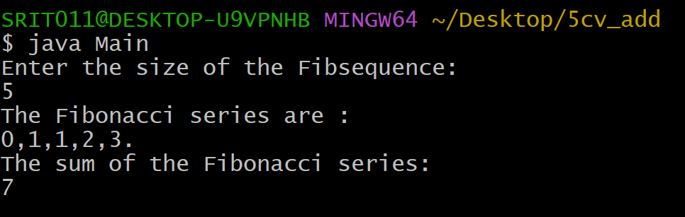

## ADDITIONAL EXPEIMENT:
## Title:To find the sum of the first n Fabonacci numbers.
## Souce code:
``` java
class Fibonacci{
  int firstNumber;
  int secondNumber;
  int thirdNumber;
  int sum;
  int n;
 Fibonacci(int size){
    firstNumber = 0;
    secondNumber = 1;
    thirdNumber = 0;
    sum = 0;
    n = size;
 }
 void generateFibSequence( ) {
   while(n > 0){
     if(n == 1)
       System.out.print(firstNumber+".");
     else 
       System.out.print(firstNumber+",");
       n--;
       sum+=firstNumber;
       thirdNumber=firstNumber+secondNumber;
       firstNumber=secondNumber;
       secondNumber=thirdNumber;
     }
   }
  int getFibSum( ) {
    if(sum>0)
      return sum;
    else{
      generateFibSequence();
      return sum;
    }
  }
}

import java.util.Scanner;
class Main{
  public static void main(String args[]){
  System.out.println("Enter the size of the Fibsequence:");
  Scanner sc=new Scanner(System.in);
  int size=sc.nextInt();
  if(size>0){
    Fibonacci fib=new Fibonacci(size);
    System.out.println("The Fibonacci series are :");
    fib.generateFibSequence();
    System.out.println("\nThe sum of the Fibonacci series: \n" + fib.getFibSum());
  }
  else
    System.out.println("cannot be calculated");
  }
}
```
## Output:


