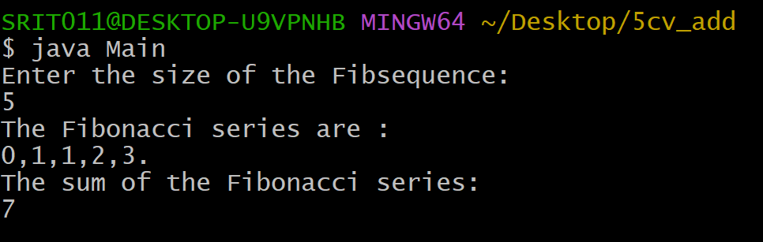
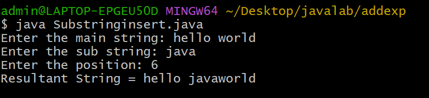
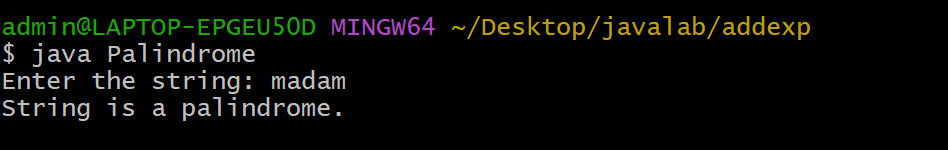
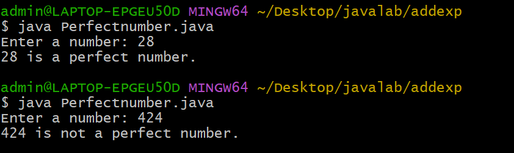
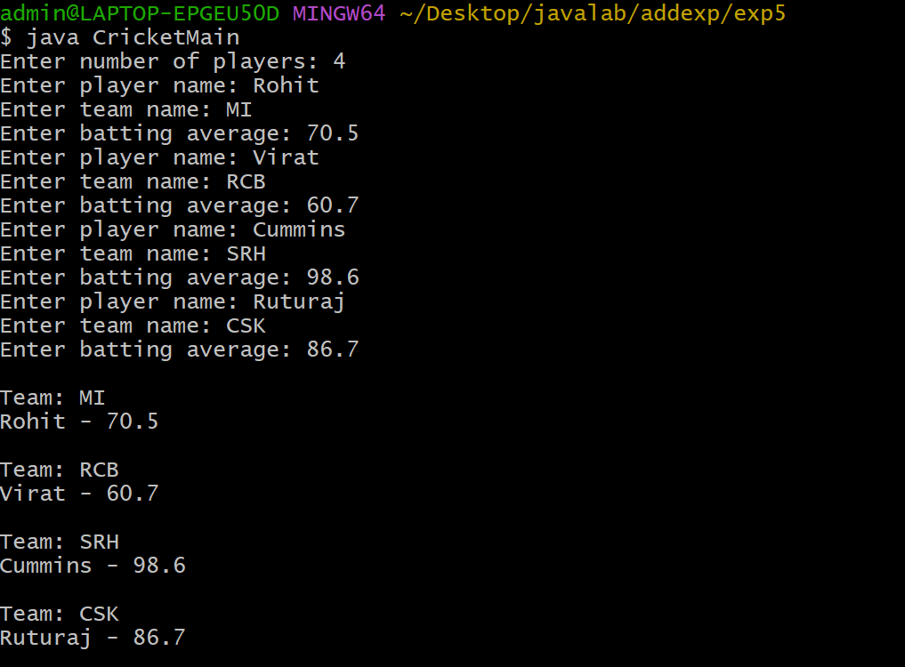

## ADDITIONAL EXPEIMENTS:
## EXPERIMENT-2
## Title:To find the sum of the first n Fabonacci numbers.
## Souce code:
``` java
class Fibonacci{
  int firstNumber;
  int secondNumber;
  int thirdNumber;
  int sum;
  int n;
 Fibonacci(int size){
    firstNumber = 0;
    secondNumber = 1;
    thirdNumber = 0;
    sum = 0;
    n = size;
 }
 void generateFibSequence( ) {
   while(n > 0){
     if(n == 1)
       System.out.print(firstNumber+".");
     else 
       System.out.print(firstNumber+",");
       n--;
       sum+=firstNumber;
       thirdNumber=firstNumber+secondNumber;
       firstNumber=secondNumber;
       secondNumber=thirdNumber;
     }
   }
  int getFibSum( ) {
    if(sum>0)
      return sum;
    else{
      generateFibSequence();
      return sum;
    }
  }
}

import java.util.Scanner;
class Main{
  public static void main(String args[]){
  System.out.println("Enter the size of the Fibsequence:");
  Scanner sc=new Scanner(System.in);
  int size=sc.nextInt();
  if(size>0){
    Fibonacci fib=new Fibonacci(size);
    System.out.println("The Fibonacci series are :");
    fib.generateFibSequence();
    System.out.println("\nThe sum of the Fibonacci series: \n" + fib.getFibSum());
  }
  else
    System.out.println("cannot be calculated");
  }
}
```
## Output:


# EXPERIMENT-1
# Tilte: Write a java program to insert a sub string into a given main string from a given position.
# SourceCode:
``` java
import java.util.Scanner;
class SubStringInsert {
    public static void main(String[] args) {

        String mainString, subString;
        int position;
        Scanner sc = new Scanner(System.in);
        System.out.print("Enter the main string: ");
        mainString = sc.nextLine();
        System.out.print("Enter the sub string: ");
        subString = sc.nextLine();
        System.out.print("Enter the position: ");
        position = sc.nextInt();
        int length = mainString.length()-1;
        String resultString;
        if (position >= 0 && position <= length) {

            String firstPart = mainString.substring(0, position);
            String secondPart = mainString.substring(position);
            resultString = firstPart + subString + secondPart;
            System.out.println("Resultant String = " + resultString);
        } 
        else {
            System.out.println("Substring is not possible to insert");
            System.out.println("Condition: 0 <= position <= length of main string");
        }
        sc.close();
    }
}
```
# Output:


# EXPERIMENT-3
# Title:write a java program to implement the given string is palindrome or not.
# Sourcecode:
```` java
import java.util.Scanner;
class Palindrome {
    public static void main(String[] args) {

        String str;
        Scanner sc = new Scanner(System.in);
        System.out.print("Enter the string: ");
        str = sc.nextLine();
        int start = 0;
        int end = str.length() - 1;
        boolean flag = true;
        while (start < end) {
            if (str.charAt(start) != str.charAt(end)) {
                System.out.println("String is not a palindrome.");
                flag = false;
                break;
            }
            start++;
            end--;
        }

        if (flag) {
            System.out.println("String is a palindrome.");
        }

        sc.close();
    }
}

````
# OUTPUT:



# EXPERIMENT-4
# Title:Write a java program to implement a perfect number.
# Source code:
``` java
import java.util.Scanner;

class PerfectNumber {
    public static void main(String args[]) {
        int num, sum = 0;
        Scanner sc = new Scanner(System.in);
        System.out.print("Enter a number: ");
        num = sc.nextInt();
        for (int i = 1; i < num; i++) {
            if (num % i == 0) {
                sum = sum + i;
            }
        }
        if (sum == num) {
            System.out.println(num + " is a perfect number.");
        } else {
            System.out.println(num + " is not a perfect number.");
        }

        sc.close();
    }
}

 ```
# Output:


# Experiment-5
# 5) Define  a class called cricket that describes the following information
# SourceCode:
``` java

class Cricket {
    String playerName;
    String teamName;
    double battingAverage;

    Cricket(String playerName, String teamName, double battingAverage) {
        this.playerName = playerName;
        this.teamName = teamName;
        this.battingAverage = battingAverage;
    }

    void display() {
        System.out.println(playerName + " - " + battingAverage);
    }
}

  import java.util.Scanner;

class CricketMain {
    public static void main(String[] args) {
        Scanner sc = new Scanner(System.in);

        System.out.print("Enter number of players: ");
        int n = sc.nextInt();
        sc.nextLine();

        Cricket[] players = new Cricket[n];

        for (int i = 0; i < n; i++) {
            System.out.print("Enter player name: ");
            String playerName = sc.nextLine();

            System.out.print("Enter team name: ");
            String teamName = sc.nextLine();

            System.out.print("Enter batting average: ");
            double battingAverage = sc.nextDouble();
            sc.nextLine();

            players[i] = new Cricket(playerName, teamName, battingAverage);
        }

        for (int i = 0; i < n; i++) {
            boolean printed = false;

            for (int k = 0; k < i; k++) {
                if (players[i].teamName.equalsIgnoreCase(players[k].teamName)) {
                    printed = true;
                    break;
                }
            }

            if (!printed) {
                System.out.println("\nTeam: " + players[i].teamName);

                for (int j = 0; j < n; j++) {
                    if (players[j].teamName.equalsIgnoreCase(players[i].teamName)) {
                        players[j].display();
                    }
                }
            }
        }

        sc.close();
    }
}

```
# Output:

