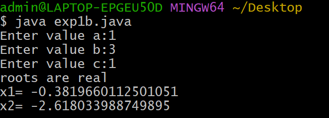

##Title:Exp 1b)Calculate the roots of a Quadratic Equation
## Source code:
''' java
import java.util.Scanner;
class QuadraticEquationSolution{
  public static void main(String[] args){
    Scanner sc=new Scanner(System.in);
    System.out.println("Enter value a:");
    double a = sc.nextDouble();
    System.out.println("Enter value b:");
    double b = sc.nextDouble();
    System.out.println("Enter value c:");
    double c = sc.nextDouble();
    double D = b*b-4*a*c;
    if(D>0){
    double x1 = (-b+Math.sqrt(D))/(2*a);
    double x2 = (-b-Math.sqrt(D))/(2*a);
    System.out.println("roots are real");
    System.out.println("x1= " + x1);
    System.out.println("x2= " + x2);
    }
    else if(D==0){
    double y = -b/(2*a);
    System.out.println("roots are equal");
    System.out.println("y= " + y);
    }
    else if(D<0){
    double z1 = -b/(2*a);
    double img1 = Math.sqrt(-D)/(2*a);
    System.out.println("roots are complex");
    System.out.println("complex roots of root1: " + z1 + "+" + img1 + "j");
    System.out.println("complex roots of root2: " + z1 + "-" + img1 + "j");
    }
    else{
    System.out.println("invalid choice");
    }
  }
}
'''
## Output:
##Case-1(D>0):

