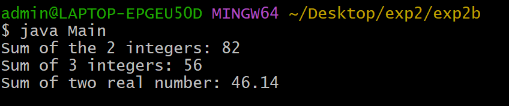

## EXPERIMENT-2
## Exp 2a) Title:Implement class mechanism in Java.Create a class,methods and invoke them inside the main method.
## Souce code:
``` java
 public class Rectangle{
   double length;
   double breadth;
 double area(){
   return length*breadth;
 }
  double perimeter(){
    return 2*(length+breadth);
 }
}

 class Main {
    public static void main (String args[]){
    Rectangle rect = new Rectangle();
     rect.length = 10;
     rect.breadth = 5;
   double area = rect.area();
   double perimeter = rect.perimeter();
   System.out.println("area of given rectangle: "+area);
   System.out.println("perimeter of given rectangle: "+perimeter);
   }
 }
```
## Output:


## Exp2b)Title:Write a JAVA program implement method overlaoding.
## Source Code:
``` java
 public class Sum{
  int Sum(int a,int b){
   return a+b;
  }
  int Sum(int a,int b,int c){
   return a+b;
  }
  double Sum(double a,double b){
   return a+b;
  }
 }
 class Main{
  public static void main(String args[]){
  Sum S = new Sum();
  System.out.println("Sum of 2 integers: "+S.Sum(20,36.46));
  System.out.println("Sum of two real number: "+S.Sum(30.465,15.675));
  }
 }
```
## Output:


 ## Exp2c)Write a JAVA program to implement constructor.
 ## Source Code:
 ``` java
  class Student{
   String sname;
   int sage;
   double smarks;
   Student(String name,int age,double marks){
   sname = name;
   sage = age;
   smarks = marks;
   }
   void display(){
   System.out.println("Student name:" + sname);
   System.out.println("Student age:" + sage);
   System.out.println("Student marks: " + smarks);
   }
 }

  class Main{
   public static void main(String args[]){
   Student s = new Student("Sumithra ",19,982);
   s.display();
   }
 }
```
## Output:


