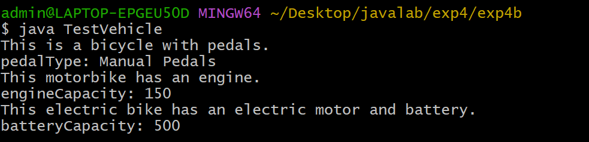
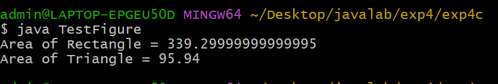

## EXPERIMENT-4
# 4A)Title:Implement Single Inheritance
# Souce Code:
``` java
 class Person {
   String name;
   int age;
   Person(String name,int age) {
     this.name = name;
     this.age = age;
   }
   void displayPersonDetails() {
     System.out.println("Name: "+name);
     System.out.println("Age: "+age);
   }
 }
 class Employee extends Person {
   double annualSalary;
   int yearOfJoining;
   String nationalInsuranceNumber;

   Employee(String name,int age,double annualSalary,int yearOfJoining,String nationalInsuranceNumber) {
     super(name,age);
     this.annualSalary = annualSalary;
     this.yearOfJoining = yearOfJoining;
     this.nationalInsuranceNumber = nationalInsuranceNumber;
   }
   void displayEmployeeDetails() {
     displayPersonDetails();
     System.out.println("AnnualSalary: "+annualSalary);
     System.out.println("YearOfJoining: "+yearOfJoining);
     System.out.println("NationalInsuranceNumber: "+nationalInsuranceNumber);
   }
 }

 class Main {
   public static void main(String args[]) {
     Employee emp = new Employee("Hemanth",28,55000.0,2026,"NI122345");
     emp.displayEmployeeDetails();
   }
```
# Output:


# 4b)Title:Implement multilevelinheritance.
# Sourcde code:
``` java
 class Bicycle {
   String pedalType;
   void showBicycleInfo() {
   System.out.println("This is a bicycle with pedals.");
   System.out.println("pedalType: "+pedalType);

   }
 }
 class Motorbike extends Bicycle {
   int engineCapacity;
   void showMotorbikeInfo() {
     System.out.println("This motorbike has an engine.");
     System.out.println("engineCapacity: "+engineCapacity);
   }
 }
 class ElectricBike extends Motorbike {
   int batteryCapacity;
   void showElectricBikeInfo() {
     System.out.println("This electric bike has an electric motor and battery.");
     System.out.println("batteryCapacity: "+batteryCapacity);
   }
 }
 
class TestVehicle {
  public static void main(String args[]) {
     ElectricBike ebike = new ElectricBike();
     ebike.pedalType = "Manual Pedals";
     ebike.engineCapacity = 150;
     ebike.batteryCapacity = 500;
     ebike.showBicycleInfo();
     ebike.showMotorbikeInfo();
     ebike.showElectricBikeInfo();
  }
}

```
# Output:



# 4c)Construct abstract classs to find areas of different shapes.
# Source Code:
``` java
 abstract class Figure {
   double dim1;
   double dim2;
   Figure(double dim1,double dim2) {
     this.dim1 = dim1;
     this.dim2 = dim2;
   }
   abstract double area();
 }
 class Rectangle extends Figure {
    Rectangle (double length,double breadth) {
     super(length,breadth);
    }
    double area() {
      double result = dim1*dim2;
      return result;
    }
 }
 class Triangle extends Figure {
    Triangle(double base,double height) {
     super(base,height);
    }
     double area() {
      double result = 0.5*dim1*dim2;
      return result;
     }
 }

public class TestFigure {
  public static void main(String args[]) {
    Figure f1 = new Rectangle(23.4,14.5);
    Figure f2 = new Triangle(12.3,15.6);
    System.out.println("Area of Rectangle = "+f1.area());
    System.out.println("Area of Triangle = "+f2.area());
  }
}
```
# Output:


 

