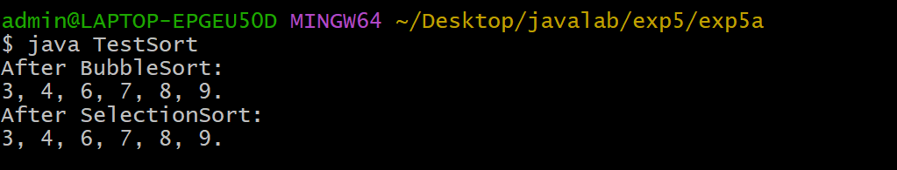
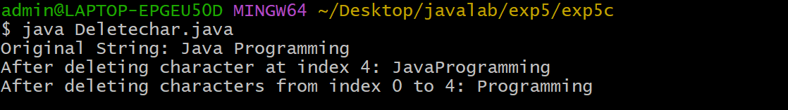

# EXPERIMENT-5
# 5A) Write a JAVA program to implement interface
# SouceCode
``` java
 interface Sortable {
   void sort(int arr[]);
 }
 class BubbleSort implements Sortable {
   public void sort(int[] arr) {
     int size = arr.length;
     int temp = 0;
     for(int i=0;i<size-1;i++) {
       for(int j=0;j<size-i-1;j++) {
         if(arr[j]>arr[j+1]) {
            temp = arr[j+1];
            arr[j+1] = arr[j];
            arr[j] = temp;
         }
       }
     }
   }
 }
 class SelectionSort implements Sortable {
   public void sort(int[] arr) {
     int size = arr.length;
     int minIndex = 0;
     int min;
     for(int i=0;i<size;i++) {
       min = arr[i];
       for(int j=i+1;j<size;j++) {
         if(min > arr[j]) {
           min = arr[j];
           minIndex = j;
         }
       }
       for(int j=minIndex;j>i;j--) {
         arr[j] = arr[j-1];
       }
       arr[i] = min;
     }
   }
 }
 class TestSort {
   static void display(int[] arr) {
     for(int ele : arr){
       System.out.print(ele+", ");
     }
     System.out.println("\b\b.");
   }
   public static void main(String args[]) {
     int arr[] = {9, 7, 4, 3, 6, 8};
     int bar[] = {8, 6, 3, 4, 7, 9};
     Sortable s;
     s = new BubbleSort();
     s.sort(arr);
     System.out.println("After BubbleSort: ");
     display(arr);
     s = new SelectionSort();
     s.sort(bar);
     System.out.println("After SelectionSort: ");
     display(bar);
   }
 }
```
# Output:


# 5B)Write a JAVA program that implements Runtime polymorphism
# Soucecode:
``` java
public class TestVehicle {
    public static void main(String[] args) {

        Vehicle v;

        v = new Car();
        v.run();

        v = new Bike();
        v.run();

        v = new Vehicle();
        v.run();
    }
}
class TestVehicle {
    public static void main(String[] args) {

        Vehicle v;

        v = new Car();
        v.run();

        v = new Bike();
        v.run();

        v = new Vehicle();
        v.run();
    }
}

```
# Output:


# 5C) write a JAVA program using StringBuffer to delete,rremove character.
# Sourcecode:
``` java
class Deletechar {
    public static void main(String args[]) {

        StringBuffer sb = new StringBuffer("Java Programming");

        System.out.println("Original String: " + sb);

        sb.deleteCharAt(4);
        System.out.println("After deleting character at index 4: " + sb);

        sb.delete(0, 4);
        System.out.println("After deleting characters from index 0 to 4: " + sb);
    }
}
```
# output:



