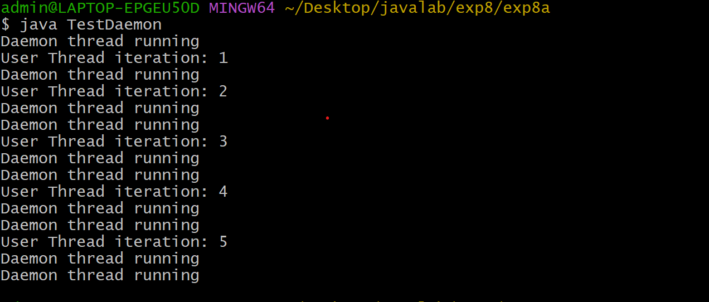
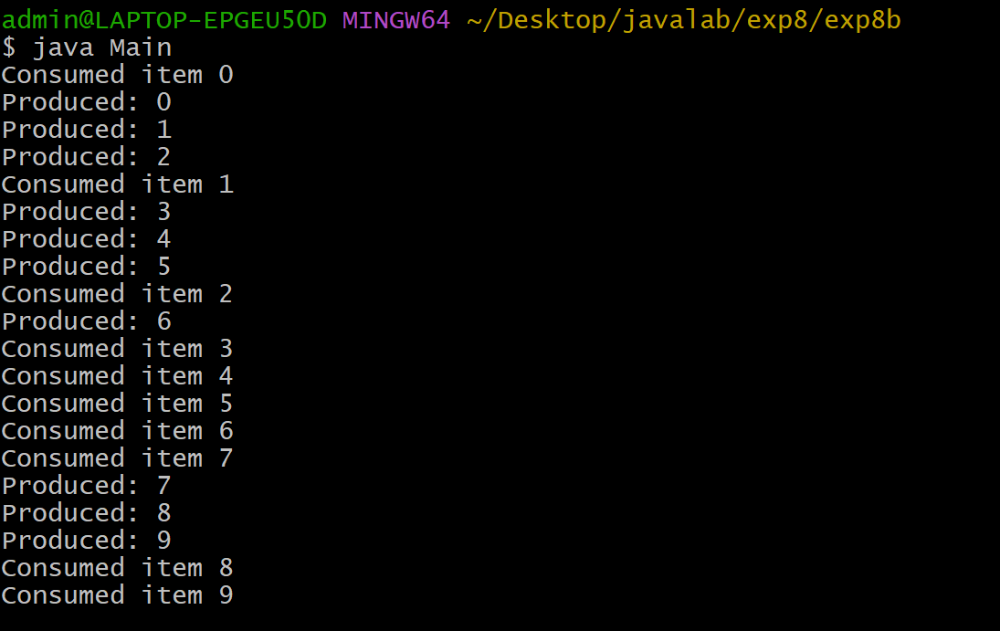
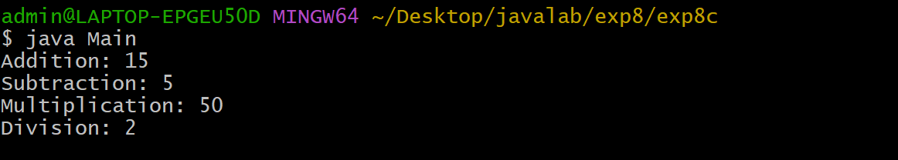

# EXPERIMENT-8
# 8A)Title:Write a program illustrating Daemon Threads.
# SourceCode:
``` java
class DaemonThread extends Thread {
    void run() {
        while(true) {
            try {
                System.out.println("Daemon thread is running");
                Thread.sleep(500);
            } catch(Exception e) {
                System.out.println("Exception occurred");
            }
        }
    }
}class UserThread extends Thread {
    void run() {
        for(int i = 0; i <= 5; i++) {
            System.out.println("User thread iteration: " + i);
            try {
                Thread.sleep(1000);
            } catch(Exception e) {
                System.out.println("Exception occurred");
            }
        }
    }
}class TestDaemon {
    public static void main(String[] args) {

        UserThread userThread = new UserThread();
        DaemonThread daemonThread = new DaemonThread();

        daemonThread.setDaemon(true);

        userThread.start();
        daemonThread.start();

        System.out.println("Main thread continues after task is completed");
    }
}
```
# OUTPUT:


# 8b) Write a JAVA program Producer Consumer Problem.
# SourceCode:
``` java
class SharedBuffer {

    int[] buffer = new int[10];
    int count = 0;
    int in = 0;
    int out = 0;

    synchronized void produce(int item) throws InterruptedException {
        while(count == buffer.length)
            wait();

        buffer[in] = item;
        in = (in + 1) % buffer.length;
        count++;
        notify();
    }

    synchronized int consume() throws InterruptedException {
        while(count == 0)
            wait();

        int item = buffer[out];
        out = (out + 1) % buffer.length;
        count--;
        notify();
        return item;
    }
}class Producer extends Thread {

    private SharedBuffer buffer;

    Producer(SharedBuffer buffer) {
        this.buffer = buffer;
    }

    public void run() {
        for(int i = 0; i < 5; i++) {
            try {
                buffer.produce(i);
                System.out.println("Produced: " + i);
            } catch(InterruptedException e) {
                System.out.println("Exception occurred");
            }
        }
    }
}class Consumer extends Thread {

    private SharedBuffer buffer;

    Consumer(SharedBuffer buffer) {
        this.buffer = buffer;
    }

    public void run() {
        for(int i = 0; i < 5; i++) {
            try {
                int item = buffer.consume();
                System.out.println("Consumed item " + item);
            } catch(InterruptedException e) {
                System.out.println("Exception occurred");
            }
        }
    }
}class Main {

    public static void main(String args[]) {

        SharedBuffer buffer = new SharedBuffer();

        Producer p = new Producer(buffer);
        Consumer c = new Consumer(buffer);

        c.start();
        p.start();
    }
}
```
# OUTPUT:


# 8C)Write a JAVA program that import and use the user defined packages
# SourceCode:
``` java
class ArithmeticOperation {

    public int add(int x, int y) {
        return x + y;
    }

    public int subtraction(int x, int y) {
        return x - y;
    }

    public int multiplication(int x, int y) {
        return x * y;
    }

    public int division(int x, int y) {
        return x / y;
    }
}
 class Main {
    public static void main(String args[]) {

        ArithmeticOperation ae = new ArithmeticOperation();

        int sum = ae.add(10, 5);
        System.out.println("Addition: " + sum);

        int diff = ae.subtraction(10, 5);
        System.out.println("Subtraction: " + diff);

        int prod = ae.multiplication(10, 5);
        System.out.println("Multiplication: " + prod);

        int div = ae.division(10, 5);
        System.out.println("Division: " + div);
    }
}
```
# Output:



